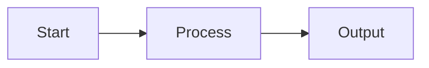

*Programming* adalah istilah dimana membuat/mengetikan suatu kode atau program ke dalam file yang nantinya dijalankan sebagai perintah oleh komputer. 



```mermaid
flowchart LR
Start --> Process
Process --> Output
```
``` python
print("Hello, World!")
```